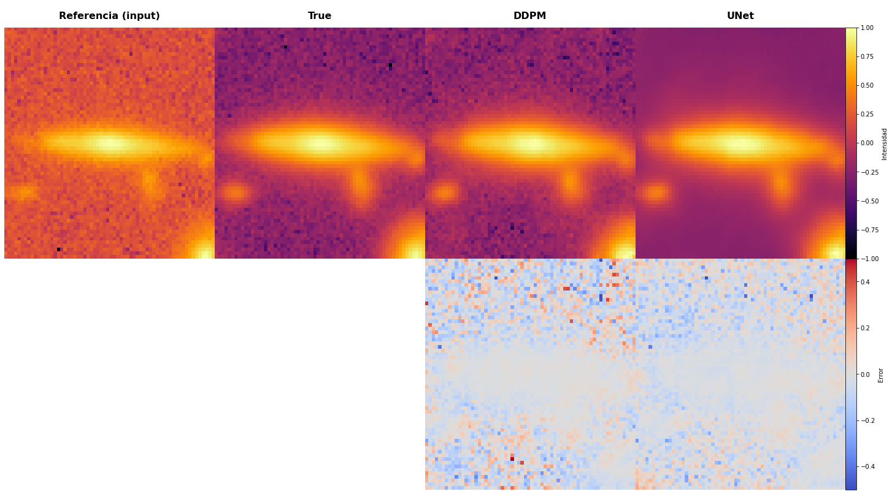

  

# DDPMs for Astronomical Image Enhancement

  

This repository contains part of the source code of my Master's Thesis, featuring complete from-scratch implementations of both U-Net and Diffusion Model architectures using PyTorch Lightning. The implementation includes all architectural components, from the basic building blocks to the complete training pipelines.

## Project Overview

The research addresses a significant challenge in observational astronomy: enhancing low Signal-to-Noise Ratio (SNR) galaxy images without requiring additional telescope observation time. The project implements and compares two deep learning approaches, both built entirely from fundamental components:

1. Residual Attention U-Net (RAUNet)
  - Custom implementation of the U-Net architecture with added innovations
  - Built with residual connections and attention mechanisms
  - Includes custom blocks for downsampling, upsampling, and spatial attention
  - Designed for direct image-to-image translation

2. Guided Diffusion Model (DDPM)
  - Complete implementation of the diffusion and denoising processes
  - Custom noise scheduling and sampling procedures
  - Probabilistic approach with conditioning mechanisms
  - Capable of generating multiple solutions for uncertainty estimation

The research demonstrated that diffusion models (DDPM) achieve superior performance in preserving complex galactic structures compared to traditional U-Net based approaches. While requiring more extensive training data and computational resources, DDPM's ability to generate multiple solutions provides valuable uncertainty estimates for astronomical research.

This implementation serves as a framework for future research in astronomical image enhancement and can be adapted for similar high-noise-to-signal transformation tasks in scientific imaging.
